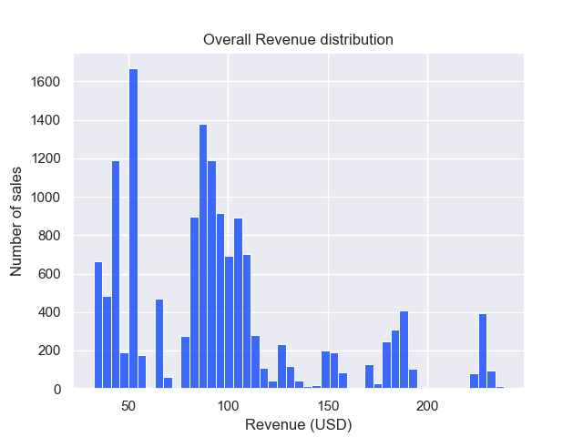
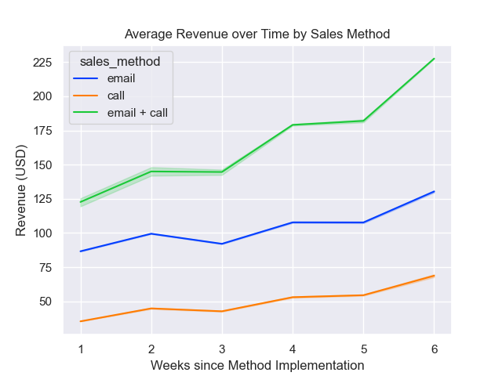

## Business Goal
Determine which is the most effective sales approach to market the new product line.

## Business Questions
* How many customers were there for each approach?
* What does the spread of the revenue look like overall? And for each method?
* Was there any difference in revenue over time for each of the methods?
* Based on the data, which method would you recommend we continue to use?
  * Some of these methods take more time from the team so they may not be the best for us to use if the results are similar.
 
## Data validation 
`week`: int
* no missing values. values are correct (integer values from 1-6). data validated. no cleaning required.

`sales_method`: object
* converted to lower case for uniformity. reduced into three categories (call, email, email + call)

`customer_id`: object
* 15000 unique values. data validated. no cleaning required.

`nb_sold`: int
* data validated. no cleaning required.

`revenue`: float
* nan values replaced with mean revenue grouped by the number of products sold. This was done because we have no information of the individual products sold. As there are multiple different products, the revenue will vary depending on which products were sold. Instead, we impute the nan values with the average revenue per number of units sold.

`years_as_customer`: int
* corrected the maximum years as customer considering the company was established in 1984. max value should be 41, as of year 2025.

`nb_site_visits`: int
* data validated. no cleaning required.

`state`: object
* data validated. 50 unique values. no cleaning required.

## Exploratory Data Analysis

From the data over the last 6 weeks, the **email method had the most number of sales** of 7000+. This was followed by the call method (approx. 5000 sales), and lastly the email + call method (approx. 2600 sales) where follow-up calls where done on emailed customers. 

The email method comprised approximately 50% of the total sales, while the call method contributed to 33%. The email + call method only contributed 17% of the total sales.

In terms of effort, the email method has the least effort and can be automated. The call method required the most effort since the sales team had to talk to the customer for 30 minutes on average. In the email + call method, the email required little work while the call only took 10 minutes on average.

In other words, the following sales order method is sorted with **increasing effort**: email, email + call, call.

A histogram was plotted to determine the overall spread of the revenue. The distribution is right-skewed where most of the sales are in the lower end of the revenue distribution. 
This is typical in business sales distribution where luxury items tend to be more expensive with fewer sales on average.

The boxplot above shows the spread of revenue across the three sales method. The email + call method had the highest median revenue (183 USD). This was followed by the email method (94 USD), and lastly the call method (50 USD)

In terms of the interquantile range (IQR), the boxplot shows that the email + call method had the largest spread. This was followed by the email method, and lastly the call method.

Although the call method required the most effort, it generated the least median and average revenue, making it less efficient. The email method provides a good balance between effort required and generated revenue.

Results imply that conducting follow-up calls after initially contacting customers via email generally produces greater revenue. It is also worth considering that the email + call method requires more effort than email method, and less effort than call method. 

The figure above shows a line plot of the average revenue over time by sales method. The graph shows that the three methods have a similar upward trend. 

It can be observed through visual inspection that the email + call method had the greatest positive slope, implying fastest revenue growth among the three methods. 
The call and email methods had similar slope values, indicating similar revenue growth.

### Which sales method is the most efficient in terms of revenue and effort required?

Given the results of our analysis, the email + call method generated the highest amount of revenue while requiring the second least amount of effort from the sales team. In other words, **email + call is the most efficient method** in terms of revenue and effort required. Furthermore, the email method also generated good revenues while requiring the least effort. This makes the email method a good second choice method in terms of revenue-effort efficiency. Since the email method has the least required effort and can be automated, it can reach to a large number of customers which is also beneficial for the company. 

On the other hand, the call method generated the least amount of revenue while requiring the most amount of effort, making it extremely inefficient. 

In summary:
* **Email + Call** → Generated the highest revenue while requiring the second least effort, making it the most efficient method overall.
    * If we plan to **maximize revenue**, we can focus on implementing the **email + call** method.
* **Email** → Produced good revenues with the least effort (and scalable through automation), making it the next best choice in terms of revenue-effort efficiency.
    * If we plan to **maximize customer reach**, we can focus on implementing the **email** method.
* **Call** → Least efficient sales method.

## Business Metrics

To monitor the effectiveness of each sales method, I propose using the average revenue per customer segemented by sales method. This metric will give us a good understanding of customer behavior and value with respect to the sales method implemented. The average revenue per customer can be updated weekly, monthly, etc. to measure the performance of the sales methods.

From the 6-week dataset, the baseline value for the average revenue per customer is the following:

| Sales Method | Average Revenue per Customer (USD) |
|---:|:---:|
| call | 48.86 |
| email | 96.33 |
| email + call | 180.30 |

Therefore, if this number is increasing for the next 6 weeks, it indicates a very good sign that the proposed sales method is working.

## Summary and Recommendations

The analysis reveals that the **email + call method** generates the highest average revenue per customer, making it the most efficient strategy in maximizing revenue and minimizing effort. I recommend focusing this method implementation to maximize pure financial return.

The **email method** showed a good second choice method because it generates good revenues with the least amount of effort. I recommend this sales method when the priority is to maximize customer reach.

Over the following weeks, I recommend using key metrics such as the **average revenue per customer** to monitor the performance of the implemented sales method.

It would be recommended to acquire individual product information (i.e. price, quantity, discounts) as these may provide additional insights and further strengthen the analysis.
